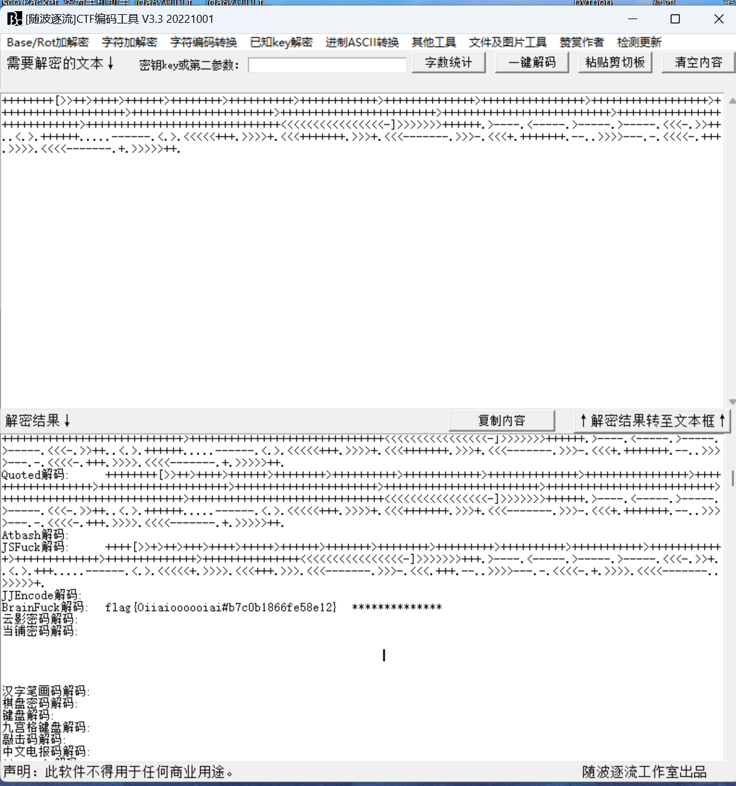
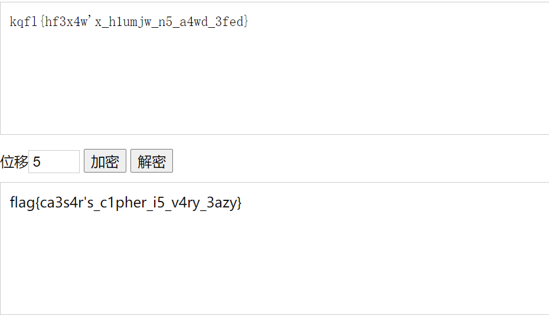
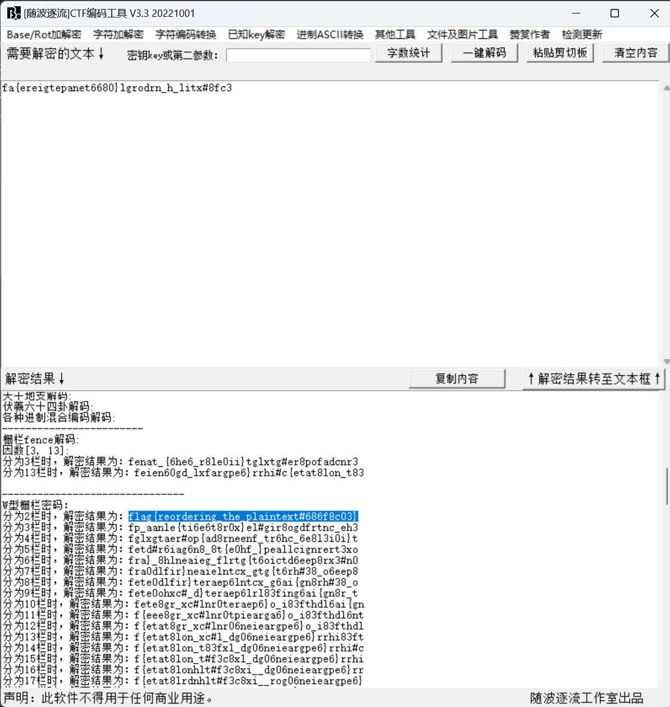
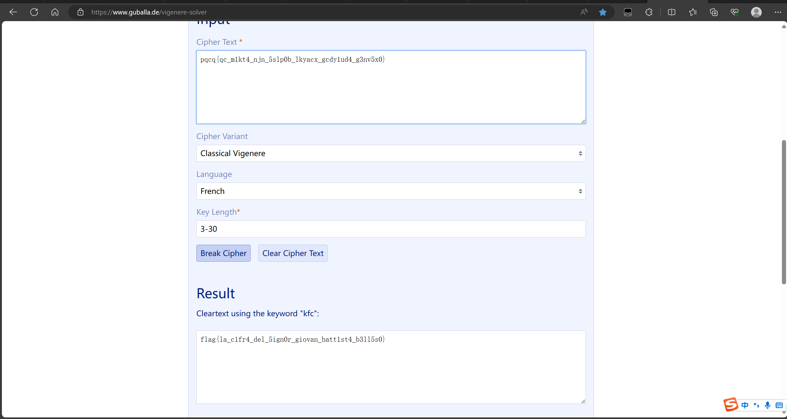
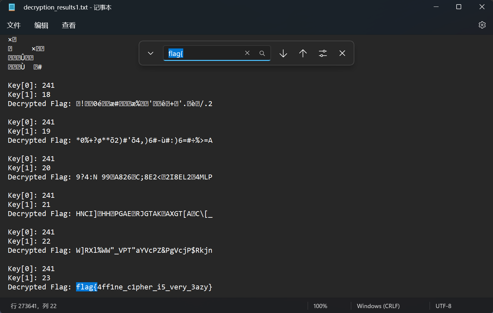

# 2023NewStarCTF--Crypto Write Up 

‍

## 1.brainfuck

​​

## 2.Caesar's Secert

​​

## 3.Fence

​​

## 4.Vigenère

​​

## 5.babyrsa

```py
from Crypto.Util.number import *
from flag import flag

def gen_prime(n):
    res = 1

    for i in range(15):
        res *= getPrime(n)

    return res


if __name__ == '__main__':
    n = gen_prime(32)
    e = 65537
    m = bytes_to_long(flag)
    c = pow(m,e,n)
    print(n)
    print(c)
# 17290066070594979571009663381214201320459569851358502368651245514213538229969915658064992558167323586895088933922835353804055772638980251328261
# 14322038433761655404678393568158537849783589481463521075694802654611048898878605144663750410655734675423328256213114422929994037240752995363595

```

exp

```py
# -*- coding: utf-8 -*-
"""
Created on Thu Sep 28 07:16:04 2023

@author: lenovo
"""
import libnum
import gmpy2
n=17290066070594979571009663381214201320459569851358502368651245514213538229969915658064992558167323586895088933922835353804055772638980251328261
c=14322038433761655404678393568158537849783589481463521075694802654611048898878605144663750410655734675423328256213114422929994037240752995363595
a = [2217990919, 2338725373, 2370292207, 2463878387, 2706073949, 2794985117, 2804303069, 2923072267, 2970591037, 3207148519, 3654864131, 3831680819, 3939901243, 4093178561, 4278428893]
phi = 1
e=65537
for x in a:
    phi *= (x - 1)
print(phi)
d=gmpy2.invert(e,phi)
print(libnum.n2s(pow(c,d,n)))
```

## 6.Small d

```py
from secret import flag
from Crypto.Util.number import *

p = getPrime(1024)
q = getPrime(1024)

d = getPrime(32)
e = inverse(d, (p-1)*(q-1))
n = p*q
m = bytes_to_long(flag)

c = pow(m,e,n)

print(c)
print(e)
print(n)

# c = 6755916696778185952300108824880341673727005249517850628424982499865744864158808968764135637141068930913626093598728925195859592078242679206690525678584698906782028671968557701271591419982370839581872779561897896707128815668722609285484978303216863236997021197576337940204757331749701872808443246927772977500576853559531421931943600185923610329322219591977644573509755483679059951426686170296018798771243136530651597181988040668586240449099412301454312937065604961224359235038190145852108473520413909014198600434679037524165523422401364208450631557380207996597981309168360160658308982745545442756884931141501387954248
# e = 8614531087131806536072176126608505396485998912193090420094510792595101158240453985055053653848556325011409922394711124558383619830290017950912353027270400567568622816245822324422993074690183971093882640779808546479195604743230137113293752897968332220989640710311998150108315298333817030634179487075421403617790823560886688860928133117536724977888683732478708628314857313700596522339509581915323452695136877802816003353853220986492007970183551041303875958750496892867954477510966708935358534322867404860267180294538231734184176727805289746004999969923736528783436876728104351783351879340959568183101515294393048651825
# n = 19873634983456087520110552277450497529248494581902299327237268030756398057752510103012336452522030173329321726779935832106030157682672262548076895370443461558851584951681093787821035488952691034250115440441807557595256984719995983158595843451037546929918777883675020571945533922321514120075488490479009468943286990002735169371404973284096869826357659027627815888558391520276866122370551115223282637855894202170474955274129276356625364663165723431215981184996513023372433862053624792195361271141451880123090158644095287045862204954829998614717677163841391272754122687961264723993880239407106030370047794145123292991433

```

exp

这里参考了[CTF-RSA_维纳攻击脚本_ctf中的rsa的维纳拓展攻击-CSDN博客](https://blog.csdn.net/fengerxi33/article/details/123007453)

```py
# -*- coding: utf-8 -*-
"""
Created on Thu Sep 28 19:01:58 2023

@author: lenovo
"""

import gmpy2
import libnum

def continuedFra(x, y):
    """计算连分数
    :param x: 分子
    :param y: 分母
    :return: 连分数列表
    """
    cf = []
    while y:
        cf.append(x // y)
        x, y = y, x % y
    return cf
def gradualFra(cf):
    """计算传入列表最后的渐进分数
    :param cf: 连分数列表
    :return: 该列表最后的渐近分数
    """
    numerator = 0
    denominator = 1
    for x in cf[::-1]:
        # 这里的渐进分数分子分母要分开
        numerator, denominator = denominator, x * denominator + numerator
    return numerator, denominator
def solve_pq(a, b, c):
    """使用韦达定理解出pq，x^2−(p+q)∗x+pq=0
    :param a:x^2的系数
    :param b:x的系数
    :param c:pq
    :return:p，q
    """
    par = gmpy2.isqrt(b * b - 4 * a * c)
    return (-b + par) // (2 * a), (-b - par) // (2 * a)
def getGradualFra(cf):
    """计算列表所有的渐近分数
    :param cf: 连分数列表
    :return: 该列表所有的渐近分数
    """
    gf = []
    for i in range(1, len(cf) + 1):
        gf.append(gradualFra(cf[:i]))
    return gf


def wienerAttack(e, n):
    """
    :param e:
    :param n:
    :return: 私钥d
    """
    cf = continuedFra(e, n)
    gf = getGradualFra(cf)
    for d, k in gf:
        if k == 0: continue
        if (e * d - 1) % k != 0:
            continue
        phi = (e * d - 1) // k
        p, q = solve_pq(1, n - phi + 1, n)
        if p * q == n:
            return d


c = 6755916696778185952300108824880341673727005249517850628424982499865744864158808968764135637141068930913626093598728925195859592078242679206690525678584698906782028671968557701271591419982370839581872779561897896707128815668722609285484978303216863236997021197576337940204757331749701872808443246927772977500576853559531421931943600185923610329322219591977644573509755483679059951426686170296018798771243136530651597181988040668586240449099412301454312937065604961224359235038190145852108473520413909014198600434679037524165523422401364208450631557380207996597981309168360160658308982745545442756884931141501387954248
e = 8614531087131806536072176126608505396485998912193090420094510792595101158240453985055053653848556325011409922394711124558383619830290017950912353027270400567568622816245822324422993074690183971093882640779808546479195604743230137113293752897968332220989640710311998150108315298333817030634179487075421403617790823560886688860928133117536724977888683732478708628314857313700596522339509581915323452695136877802816003353853220986492007970183551041303875958750496892867954477510966708935358534322867404860267180294538231734184176727805289746004999969923736528783436876728104351783351879340959568183101515294393048651825
n = 19873634983456087520110552277450497529248494581902299327237268030756398057752510103012336452522030173329321726779935832106030157682672262548076895370443461558851584951681093787821035488952691034250115440441807557595256984719995983158595843451037546929918777883675020571945533922321514120075488490479009468943286990002735169371404973284096869826357659027627815888558391520276866122370551115223282637855894202170474955274129276356625364663165723431215981184996513023372433862053624792195361271141451880123090158644095287045862204954829998614717677163841391272754122687961264723993880239407106030370047794145123292991433

d=wienerAttack(e, n)
m=pow(c, d, n)
print(libnum.n2s(m).decode())

```

## 7.babyxor

```py
from secret import *

ciphertext = []

for f in flag:
    ciphertext.append(f ^ key)

print(bytes(ciphertext).hex())
# e9e3eee8f4f7bffdd0bebad0fcf6e2e2bcfbfdf6d0eee1ebd0eabbf5f6aeaeaeaeaeaef2
```

exp

```py
# -*- coding: utf-8 -*-
"""
Created on Mon Sep 25 17:40:06 2023

@author: lenovo
"""
from Crypto.Util.number import *

s = 'e9e3eee8f4f7bffdd0bebad0fcf6e2e2bcfbfdf6d0eee1ebd0eabbf5f6aeaeaeaeaeaef2'
decode_s = bytes.fromhex(s)  # 根据题目提示，先进行16进制解码
key = 143

a = []  # 创建一个空列表来存储结果

for i in range(len(decode_s)):  # 使用range(len(decode_s))来迭代列表的索引
    a.append(key ^ decode_s[i])  # 计算异或并将结果添加到列表中

print(bytes(a))

```

## 8.babyencoding

```txt
part 1 of flag: ZmxhZ3tkYXp6bGluZ19lbmNvZGluZyM0ZTBhZDQ=
part 2 of flag: MYYGGYJQHBSDCZJRMQYGMMJQMMYGGN3BMZSTIMRSMZSWCNY=
part 3 of flag: =8S4U,3DR8SDY,C`S-F5F-C(S,S<R-C`Q9F8S87T`

part 1：base64
part 2：base32
part 3：UUencode
flag{dazzling_encoding#4e0ad4f0ca08d1e1d0f10c0c7afe422fea7c55192c992036ef623372601ff3a}
```

## 9.Affine

```py
from flag import flag, key

modulus = 256

ciphertext = []

for f in flag:
    ciphertext.append((key[0]*f + key[1]) % modulus)

print(bytes(ciphertext).hex())

# dd4388ee428bdddd5865cc66aa5887ffcca966109c66edcca920667a88312064


```

exp

由于仿射密码的密钥空间很小，这里小小的爆破一下就行了

```py
# -*- coding: utf-8 -*-
"""
Created on Wed Sep 27 08:02:48 2023

@author: lenovo
"""
ciphertext_hex = "dd4388ee428bdddd5865cc66aa5887ffcca966109c66edcca920667a88312064"
ciphertext = bytes.fromhex(ciphertext_hex)
modulus = 256

target_plaintext = "Your target plaintext here"

output_file_name = "decryption_results1.txt"
with open(output_file_name, "w", encoding="utf-8") as output_file:
    for key0 in range(modulus):
        for key1 in range(modulus):
            decrypted_flag = []

            for ciphertext_char in ciphertext:
                original_char = (ciphertext_char - key1) * key0 % modulus
                decrypted_flag.append(original_char)

            original_flag = "".join(map(chr, decrypted_flag))

            output_file.write("Key[0]: {}\n".format(key0))
            output_file.write("Key[1]: {}\n".format(key1))
            output_file.write("Decrypted Flag: {}\n".format(original_flag))
            output_file.write("\n")  # 空行分隔每个密钥组合的输出

            if original_flag == target_plaintext:
                output_file.write("Found key:\n")
                output_file.write("Key[0]: {}\n".format(key0))
                output_file.write("Key[1]: {}\n".format(key1))
                break

print("结果已导出到", output_file_name)


```

​​

## 10.babyaes

```py
from Crypto.Cipher import AES
import os
from flag import flag
from Crypto.Util.number import *


def pad(data):
    return data + b"".join([b'\x00' for _ in range(0, 16 - len(data))])


def main():
    flag_ = pad(flag)
    key = os.urandom(16) * 2
    iv = os.urandom(16)
    print(bytes_to_long(key) ^ bytes_to_long(iv) ^ 1)
    aes = AES.new(key, AES.MODE_CBC, iv)
    enc_flag = aes.encrypt(flag_)
    print(enc_flag)


if __name__ == "__main__":
    main()
# 3657491768215750635844958060963805125333761387746954618540958489914964573229
# b'>]\xc1\xe5\x82/\x02\x7ft\xf1B\x8d\n\xc1\x95i'
```

exp

参考了[[ACTF新生赛2020]crypto-aes（考点：AES）-CSDN博客](https://blog.csdn.net/MikeCoke/article/details/113790052)

```py
# -*- coding: utf-8 -*-
"""
Created on Mon Sep 25 19:08:24 2023

@author: lenovo
"""

#python3
from Crypto.Cipher import AES
import os
from gmpy2 import*
from Crypto.Util.number import*

xor = 3657491768215750635844958060963805125333761387746954618540958489914964573229
enc_flag = b'>]\xc1\xe5\x82/\x02\x7ft\xf1B\x8d\n\xc1\x95i'
out = long_to_bytes(xor)
key = out[:16]*2
# print(key)
iv = bytes_to_long(key[16:])^bytes_to_long(out[16:])^1
# print(iv)
iv = long_to_bytes(iv)
# print(iv)
aes = AES.new(key,AES.MODE_CBC,iv)
flag = aes.decrypt(enc_flag)
print(flag)

```
